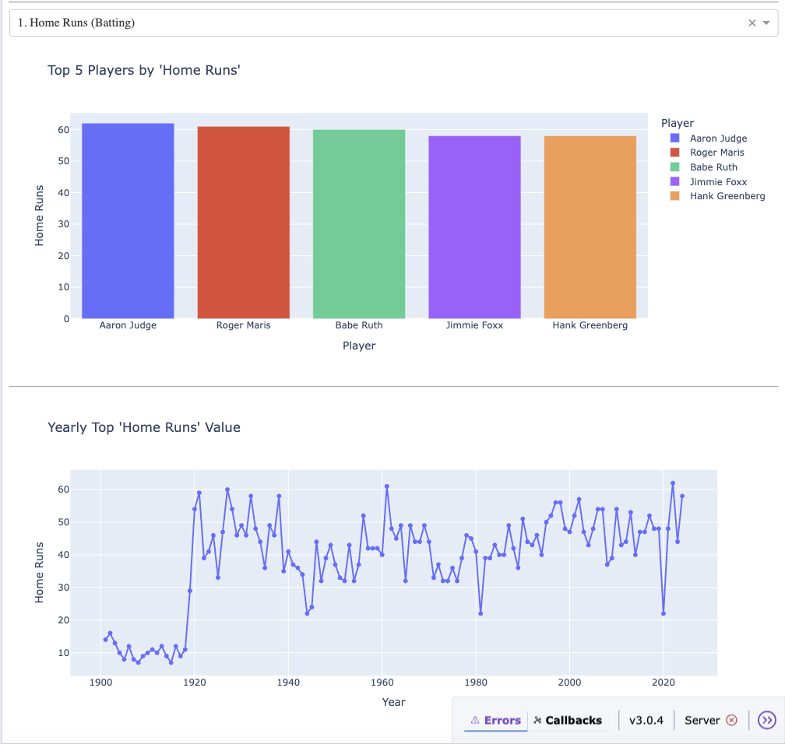

# Baseball History: Web Scraping & Dashboard Project

##  Overview
An end-to-end project that scrapes historical Major League Baseball data and presents it in an interactive dashboard using Dash.

- **Data Source**: [Baseball Almanac - Yearly MLB History](https://www.baseball-almanac.com/yearmenu.shtml)  
- **Live Dashboard**: [https://baseball-history-ad.onrender.com/](https://baseball-history-ad.onrender.com/)

---

## Project Components

### 1. Web Scraping Program
**Goal**: Collect baseball data from the web.

- Uses **Selenium** to navigate the Baseball Almanac site.
- Extracts relevant statistics.
- Saves raw data to CSV files.

---

### 2. Database Import Program
**Goal**: Import scraped data into a **SQLite** database.

- Loads each CSV into a corresponding table.
- Ensures correct data types.
- Includes error handling during the import.

---

### 3. Database Query Program
**Goal**: Run custom SQL queries on the database.

- Interactive command-line interface.
- Lets users choose stats to explore.
- Handles errors and displays results appropriately.

---

### 4. Dashboard Program
**Goal**: Visualize baseball stats dynamically.

- Top 10 teams by batting and pitching leaders.
- Top 5 players by selected stat.
- Yearly trend line for selected stat.
- Built with **Dash** and **Plotly** for interactive UI.

---

## Technologies Used
- Python
- Selenium
- Pandas
- SQLite
- Plotly
- Dash

---
## Setup Instructions
- Clone the Repository
- Install Dependencies (requirements.txt)

---
## Screenshots

